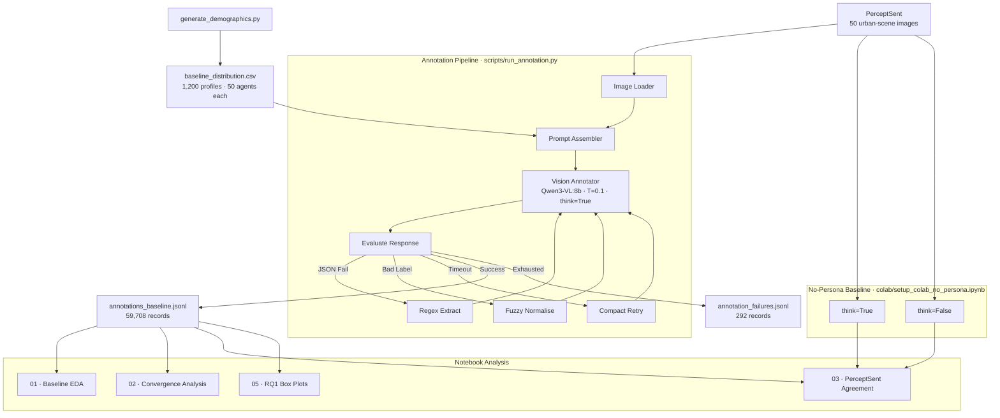

# Stable Behavior, Limited Variation: Persona Validity in LLM Agents for Urban Sentiment Perception

---


---

## Pipeline Overview



---

## Setup

**Requirements:** Python 3.11+, [uv](https://docs.astral.sh/uv/), [Ollama](https://ollama.com/) (only to re-run experiments — pre-computed results are included).

```bash
git clone https://github.com/neemiasbsilva/mllm-persona-evaluation.git
cd mllm-persona-evaluation
uv sync
cp .env.example .env   # edit model names, Ollama URL, concurrency
```

---

## Reproducing the Results

### Notebooks (pre-computed outputs — recommended)

All figures were generated from `outputs/annotations_baseline.jsonl`. Run any notebook directly:

```bash
uv run jupyter nbconvert --to notebook --execute \
    --ExecutePreprocessor.timeout=600 \
    notebooks/01_baseline_distribution_eda.ipynb \
    --output-dir /tmp/nb_exec/
```

### Annotation (baseline: 1,200 personas × 50 images)

```bash
export OLLAMA_NUM_PARALLEL=1
export OLLAMA_FLASH_ATTENTION=1
export OLLAMA_KV_CACHE_TYPE=q8_0
ollama serve
```

```bash
ollama pull qwen3-vl:8b

uv run python scripts/run_annotation.py \
    --condition baseline \
    --n-personas 1200 --n-images 50

# Smoke-test (3 personas × 5 images)
uv run python scripts/run_annotation.py \
    --condition baseline \
    --n-personas 3 --n-images 5 --limit 10
```

### No-Persona Baselines (think=True and think=False)

```bash
# think=True
uv run python scripts/run_annotation_no_persona.py \
    --think \
    --baseline-jsonl outputs/annotations_baseline.jsonl \
    --max-concurrent 1 \
    --output-dir outputs/

# think=False
uv run python scripts/run_annotation_no_persona.py \
    --no-think \
    --baseline-jsonl outputs/annotations_baseline.jsonl \
    --max-concurrent 1 \
    --output-dir outputs/
```

On Google Colab (T4 GPU), use `colab/setup_colab_no_persona.ipynb` — it handles Ollama installation, image extraction from Drive, and both conditions end-to-end.

**GPU tuning guide:**

| VRAM  | `--max-concurrent` | `OLLAMA_NUM_PARALLEL` |
|-------|-------------------|-----------------------|
| 20 GB | 1–2               | 1–2                   |
| 40 GB | 3–4               | 3–4                   |
| 95 GB | 6–8               | 6–8                   |

The pipeline is **crash-resilient**: on restart it skips `(persona_id, image_id)` pairs already written to the output file.

---

## Data

- **`data/generate_demographics.py`** — generates the 2×2×2×3 factorial profile grid
- **`data/baseline_distribution.csv`** — 1,200 seed demographic profiles (24 profiles × 50 agents, `random_seed=42`)
- **`data/perceptsent-raw/dataset.json`** — PerceptSent dataset metadata (5,000 images, human GT annotations)
- **`data/perceptsent-agreement/`** — 12 agreement-filtered subsets (σ ∈ {3,4,5} × problem type)
- **`data/raw_images/`** — place PerceptSent JPEG files here as `{image_id}.jpg`

### Downloading the datasets

**PerceptSent raw** (`data/perceptsent-raw/`) — clone the original repository and copy the metadata:

```bash
git clone https://github.com/ceslop84/perceptsent /tmp/perceptsent-raw
cp -r /tmp/perceptsent-raw/. data/perceptsent-raw/
```

**PerceptSent agreement** (`data/perceptsent-agreement/`) — download the 12 agreement-filtered subsets from Google Drive:

> [https://drive.google.com/drive/folders/1mopyjmtWCFNT-GbuX9MqWjNXPE-FA58Y](https://drive.google.com/drive/folders/1mopyjmtWCFNT-GbuX9MqWjNXPE-FA58Y)

Place the downloaded folder contents under `data/perceptsent-agreement/`.

You can also use `gdown` to download programmatically:

```bash
pip install gdown
gdown --folder https://drive.google.com/drive/folders/1mopyjmtWCFNT-GbuX9MqWjNXPE-FA58Y \
    -O data/perceptsent-agreement/
```

**Raw images** (`data/raw_images/`) — download the ZIP archive from Google Drive and extract it:

> [https://drive.google.com/file/d/1JKgmFh2VRHZMD3eekIY0-Y25ODIhV5zI/view?usp=share_link](https://drive.google.com/file/d/1JKgmFh2VRHZMD3eekIY0-Y25ODIhV5zI/view?usp=share_link)

```bash
pip install gdown
gdown 1JKgmFh2VRHZMD3eekIY0-Y25ODIhV5zI -O /tmp/raw_images.zip
unzip /tmp/raw_images.zip -d data/raw_images/
```

Each image must be accessible as `data/raw_images/{image_id}.jpg`.

---

## Outputs

Pre-computed results are included. Each line in `outputs/annotations_baseline.jsonl` is a JSON record:

```json
{
  "annotation_id": "p<prefix>_img_<image_id>_baseline",
  "persona_id":    "<uuid>",
  "image_id":      "<perceptsent_image_id>",
  "condition":     "baseline",
  "raw_demographics": {
    "gender": "Female", "economic_status": "High income",
    "political_spectrum": "Progressive", "personality": "Empathetic"
  },
  "predicted_sentiment":   "Positive",
  "predicted_perceptions": ["Green/Natural", "Lively"],
  "caption":               "A tree-lined street with pedestrians walking on a sunny day.",
  "justification":         "This kind of vibrant, green space is exactly what every neighborhood deserves.",
  "parse_retries":         0,
  "timestamp_utc":         "2026-04-30T14:23:07Z"
}
```

Experiment documentation and per-notebook result summaries are in [`docs/`](docs/).

---

## Citation

```bibtex
@misc{dasilva2026stablebehaviorlimitedvariation,
      title={Stable Behavior, Limited Variation: Persona Validity in LLM Agents for Urban Sentiment Perception}, 
      author={Neemias B da Silva and Rodrigo Minetto and Daniel Silver and Thiago H Silva},
      year={2026},
      eprint={2604.28048},
      archivePrefix={arXiv},
      primaryClass={cs.CL},
      url={https://arxiv.org/abs/2604.28048}, 
}
```

---

## Acknowledgments

Supported by the SocialNet project (FAPESP 2023/00148-0), CNPq (314603/2023-9, 441444/2023-7, 409669/2024-5, 444724/2024-9), and INCT TILD-IAR (CNPq 408490/2024-1).
